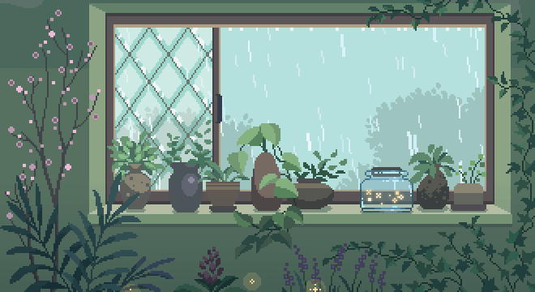

  

<h3 align="center">🌿 Web Development Student • Junior Frontend / Full Stack Developer</h3>

  

  
  
  

 

  

<h2 align="center">🌱 About Me</h2>

  I’m training to become a <strong>Junior Frontend / Full Stack Developer</strong>, focused on building
  useful, well-structured and high-performance web applications.

  👩‍💻 Second-year student in <strong>Web Application Development (DAW)</strong> 
  🌿 Learning technologies such as <strong>Angular</strong> and deepening my frontend knowledge 
  ✨ Interested in <strong>frontend</strong> and <strong>full-stack</strong> roles

  
  
  
  

 

  

<h2 align="center">🌾 Tech Stack</h2>

<table align="center">
  <tr>
    <td align="center" width="240" valign="top">
        
      
    </td>
    <td align="center" width="34" valign="middle">
      ❋
    </td>
    <td align="center" width="240" valign="top">
        
      
    </td>
  </tr>

  <tr>
    <td align="center" width="240" valign="top">
        
      
    </td>
    <td align="center" width="34" valign="middle">
      ❋
    </td>
    <td align="center" width="240" valign="top">
        
      
    </td>
  </tr>

  <tr>
    <td align="center" width="240" valign="top">
        
      
    </td>
    <td align="center" width="34" valign="middle">
      ❋
    </td>
    <td align="center" width="240" valign="top">
        
      
    </td>
  </tr>
</table>

 

  

<h2 align="center">🍃 What I Love Building</h2>

  
  
  
  

  ✿ Creating interfaces that feel clean, balanced and pleasant to use ✿

 

  

<h2 align="center">🌍 Work Environment</h2>

  
  &nbsp;&nbsp;&nbsp;
  

  
  &nbsp;&nbsp;&nbsp;&nbsp;&nbsp;&nbsp;
  

 

  

<h2 align="center">🌼 Socials</h2>

  
  

  

  

<h2 align="center">🌿 GitHub Activity</h2>

  A small snapshot of my learning journey, projects and progress through GitHub.

 

  
  

 

  

